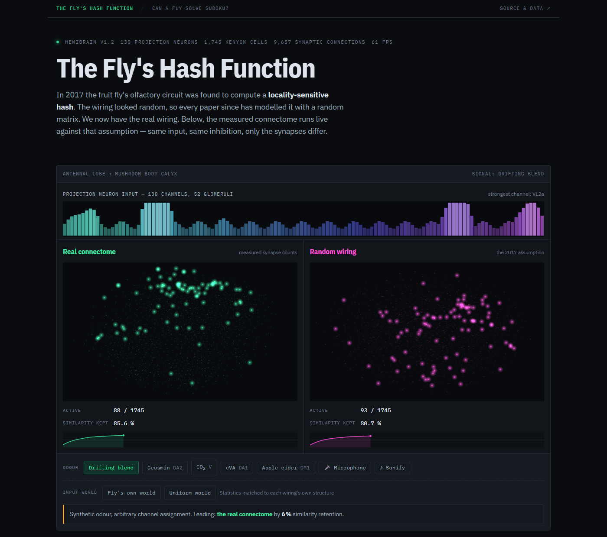
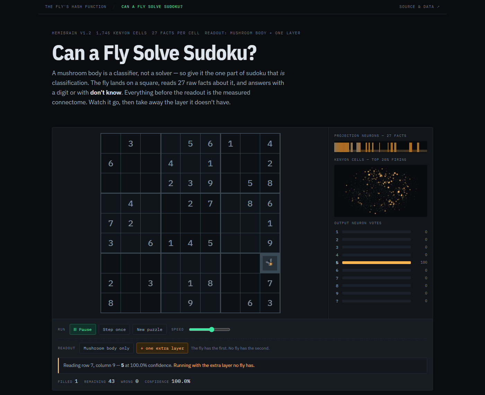

# The Fly's Hash Function

Two studies on the measured *Drosophila* mushroom body connectome, each with a
live browser demo.

**Demos** &nbsp;
[The Fly's Hash Function](https://realgauravvyas.github.io/flys-hash-function/) ·
[Can a Fly Solve Sudoku?](https://realgauravvyas.github.io/flys-hash-function/sudoku.html)

<p>
<a href="https://realgauravvyas.github.io/flys-hash-function/">
  
</a>
<a href="https://realgauravvyas.github.io/flys-hash-function/sudoku.html">
  
</a>
</p>

---

## Study 1 — the fly as a hash function

Is the fruit fly's *measured* olfactory wiring a better locality-sensitive hash
than the random matrix the literature has been substituting for it since 2017?

## Background

Dasgupta, Stevens & Navlakha (*Science* 2017) showed the fly's mushroom body
computes a locality-sensitive hash: ~130 projection neurons expand into ~1,745
Kenyon cells, feedback inhibition keeps the top 5%, and the survivors are the
hash code. The wiring looked random at the time (Caron et al. 2013), so FlyHash,
BioHash, SoftHash and everything downstream model it with a **random** matrix.

Zheng et al. (*Current Biology* 2022) then showed the sampling is **not** random.
But they tested that structure only on odour discrimination in a biophysical
model. Nobody had asked the computer-science question: does the real matrix
hash better?

## Result

It does not. On generic similarity search the real connectome is ~20% **worse**
than the idealised random matrix standing in for it (precision@16, 5 seeds,
shared fixed encoder so only the 130x1745 matrix varies):

| Matrix | MNIST | Fashion-MNIST | Correlated |
|---|---|---|---|
| Real connectome | 0.4993 | 0.4800 | 0.3677 |
| Real wiring, weights removed | 0.5472 | 0.5184 | 0.4197 |
| Degree-preserving rewire | 0.5520 | 0.5239 | 0.4268 |
| Sampling-bias matched | 0.5550 | 0.5275 | 0.4299 |
| Weights shuffled | 0.5170 | 0.4955 | 0.3896 |
| **Random (the 2017 model)** | **0.6212** | **0.5812** | **0.5108** |
| Classical dense LSH | 0.2414 | 0.2090 | 0.1650 |

The nulls decompose the cost: projection-neuron out-degree heterogeneity
-10.6%, synaptic weighting -8.8%, and the co-occurrence structure Zheng et al.
emphasised only -0.9%.

But it is **specialised**, not simply worse. Feed each matrix input drawn from
the world its own wiring implies and the result inverts:

| Input world | Real | Degree-preserving | Random |
|---|---|---|---|
| The fly's own world | 0.2187 | **0.2304** | 0.1552 |
| Degree-matched world | 0.2099 | **0.2351** | 0.1547 |
| Uniform random world | 0.0944 | 0.0957 | **0.1619** |

Real beats random by +40.9% in its own world and loses by -41.7% in a uniform
one — a clean double dissociation. Note that degree-preserving rewiring
slightly *beats* the real matrix even in the real matrix's own world, so the
specialisation lives in the degree sequence, not in which specific glomeruli
share a cell.

## Running it

```
python src/extract_connectome.py    # real matrix + 4 matched nulls
python src/benchmark.py             # experiment 1 (downloads MNIST/Fashion-MNIST)
python src/specialization.py        # experiment 2, the double dissociation
python src/export_web.py            # pack for the browser
```

Needs numpy, scipy, scikit-learn, pandas, torch. CUDA is used if present.

## Data

Hemibrain v1.2 traced adjacency release (Janelia FlyEM, CC BY),
`storage.googleapis.com/hemibrain/v1.2/exported-traced-adjacencies-v1.2.tar.gz`
— no authentication required. 130 uniglomerular olfactory projection neurons
across 52 glomeruli onto 1,745 Kenyon cells, 171,623 synapses, 3-synapse
connection threshold.

## Not done yet

- **Male vs female.** The male CNS connectome (Janelia + Google, *Cell*,
  3 Sept 2026; 166k neurons) would let the same comparison run across sexes for
  the first time. It needs a neuPrint token, so it is not wired up here — see
  `neuprint-python` with `male-cns:v1.0`.
- **Real odour statistics.** The "fly's own world" here is synthetic, sampled
  from the connectome's own co-occurrence covariance. Hallem & Carlson's
  receptor-response panel would give a measured odour distribution to test
  against, and would make the specialisation claim much stronger.
- **Does the fly's degree sequence beat random on data matched to natural
  odour statistics specifically?** That is the experiment that would turn this
  from a negative result into a positive one.


---

## Study 2 — can a fly solve sudoku?

Short answer: no, and the reason is locatable.

A mushroom body is a classifier, not a solver, so it was given the part of
sudoku that genuinely is classification. The circuit sees 27 raw facts about
one square — for each digit, whether it already appears in that square's row,
column and box — and answers with a digit or with "don't know". Nothing is
pre-computed: candidate lists are exactly what it has to learn to derive. The
fly supplies the inference; flying square to square supplies the iteration.

Everything upstream of the readout is the measured connectome, with the 27
facts placed onto glomeruli this wiring actually samples onto shared Kenyon
cells — the co-occurrence structure Study 1 found the circuit specialised for.

### Where the deduction is lost

| Readout | Accuracy on single-candidate squares |
|---|---|
| Small network on the raw 27 facts | 1.0000 |
| Kenyon cells → output neurons (**the fly**) | 0.9259 |
| Kenyon cells → one extra layer → output | 0.9977 |

The task is trivially learnable, and the sparse Kenyon cell code retains
99.77% of what is needed. The failure is the last step: a mushroom body has
exactly **one** learned layer, and one linear layer cannot pull the answer
back out of the code.

### What that costs on whole puzzles

| Readout | Puzzles solved | Squares filled | Corrupted |
|---|---|---|---|
| The fly | 2 / 40 | 17.3% | 0 |
| + one extra layer | 40 / 40 | 100.0% | 0 |

Both readouts answer only above a confidence threshold calibrated to 99.9%
precision, which is why neither ever corrupts a board — the circuit stops
rather than guesses.

```
python src/sudoku_fly.py     # encoding, naked-single labelling, the fly's own
                             # depression learning rule
python src/diagnose.py       # locates the loss: task / graded KC / binarised KC
python src/sudoku_train.py   # trains both readouts, exports the demo
```

A note on the depression rule: the mushroom body learns by dopamine-gated
*depression* of Kenyon-cell-to-output synapses, and `sudoku_fly.py` implements
it. Over ten output neurons it performs near chance (~0.11). That is a real
limitation of depression-only learning at this fan-out, not a bug — the real
circuit works with a small number of opposing output channels, not ten
competing ones.
